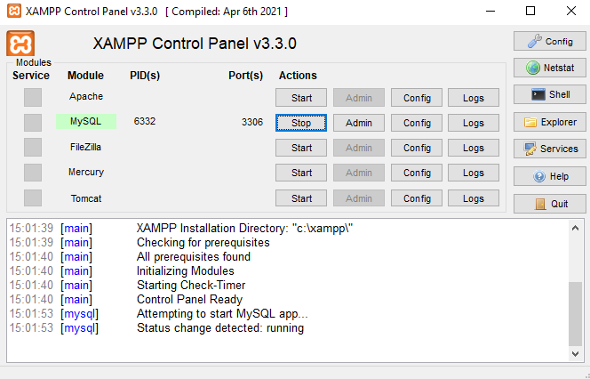
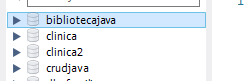

### Projeto biblioteca

##1. após iniciar o projeto configurarar conexão com o banco:

#* application.properties

spring.jpa.hibernate.ddl-auto=update
spring.datasource.url = jdbc:mysql://localhost:3306/BibliotecaJava?createDatabaseIfNotExist=true
spring.datasource.driver-class-name=com.mysql.cj.jdbc.Driver
spring.datasource.username=root
spring.datasource.password=

pring.jpa.properties.hibernate.dialect = org.hibernate.dialect.MySQLDialect //configuração do hibernate
spring.jpa.show-sql=true

#2. XAMPP
iniciar mysql para verificar a criação da database

database criada com sucesso

#3. criação de model (livro)
java/biblioteca/gerenciamento/model
    Classe: livroModel.java

    A classe LivroModel tem seus respectivos atributos e métodos construtores.

#4. Criação da pasta Enum
    enum de StatusEnum pra verificar a sitação dos livros 
    Implementação do hibernate na classe LivroModel

#5. Criação da classe usuarioModel na pasta model

    foi implementado com seus respectivos atributos e as notacions do hibernate

#6. Criação da classe emprestimoModel para relizar a tabela de relacionamento do livro emprestado e o usuario que esta com o livro

